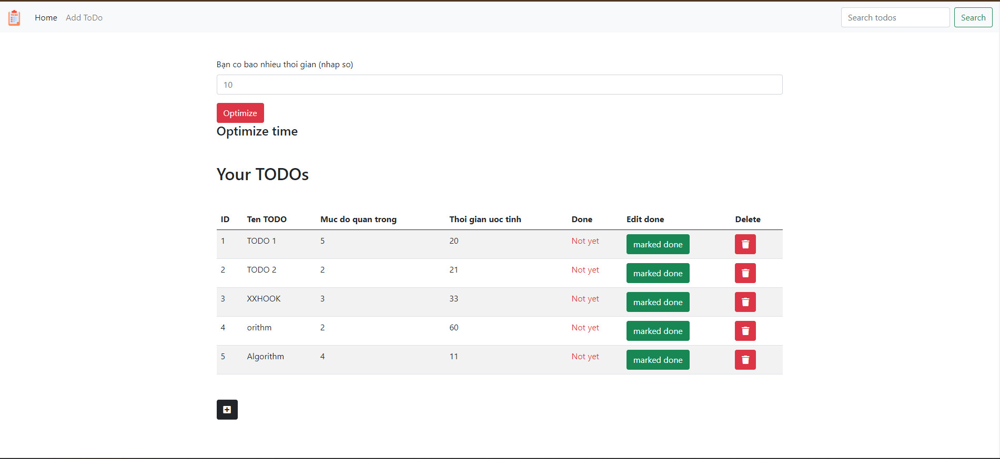
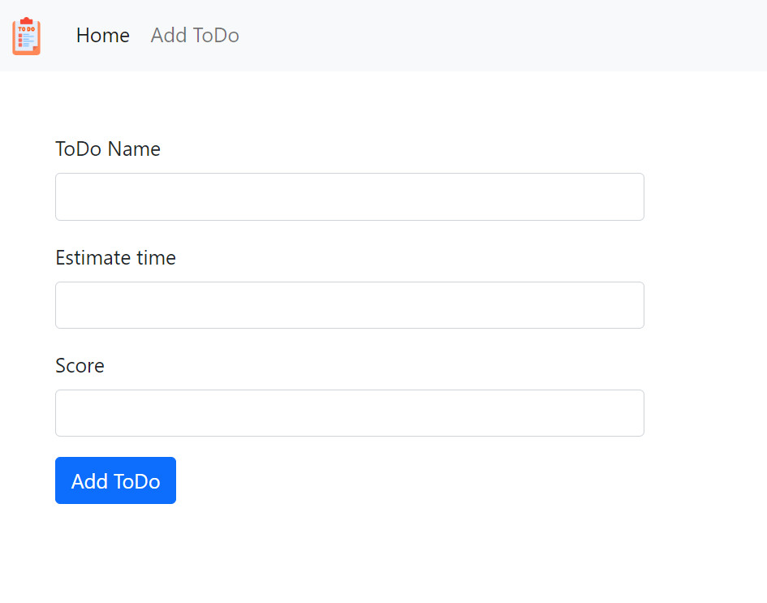
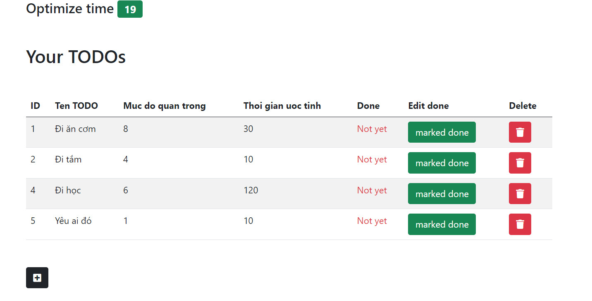
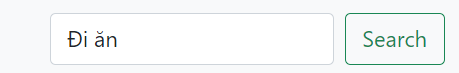
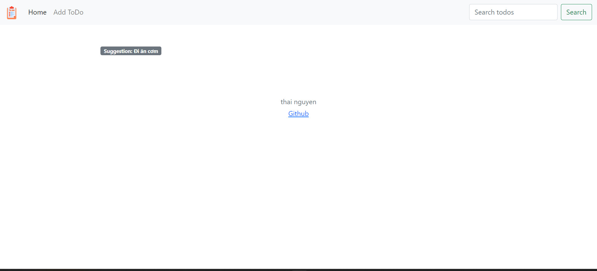
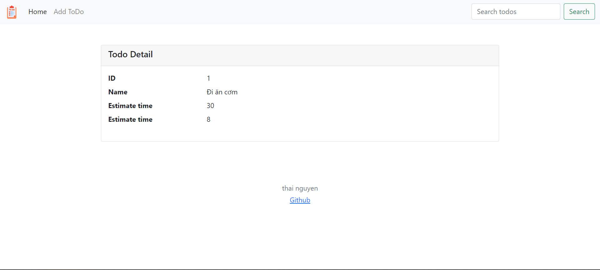

# Getting Started
#### Project's name: ToDo list
</img>
##### Motivation
Động lực khiến tôi viết dự án này là tôi muốn đơn giản hóa thuật toán & kĩ thuật nho nhỏ  để ứng dụng vào một dự án nho nhỏ. 

##### Tech/Framework used
<ul>
    <li>Language: Java</li>
    <li>Framework: Spring boot and some spring's modules</li>
    <li>View page: Bootstrap 5  and Thymeleaf</li>
    <li>Build tool: Maven</li>
    <li>Algorithm and tech: Dynamic programming</li>
</ul>

##### Features:
<ul>
    <li>
        Display todo list and easy to create, delete, and marked done for any todo
        
        👍Creation
        
    </li>
    <li>
        Optimize todo with little time left, example: 200p 😍😍😍
        
    </li>
    <li>
        Using dynamic programming basic (longest common subsequence) to the search feature
        
        Result: 🥳🥳🥳
        
        Click to display suggestion:
        
        In practise, important to understand that identifier of domain object never be displayed
    </li>
</ul>

##### 
_!!! This is a mini project learning 📄📄📄_
